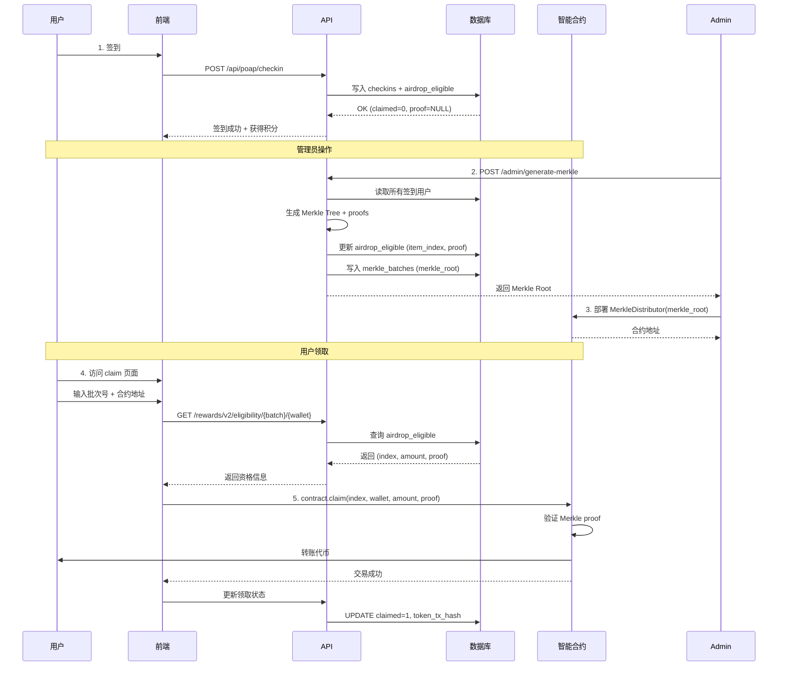

# ✅ Claim 页面错误已解决

## 问题总结

用户在成功签到后访问 claim 页面时遇到错误，无法领取代币。

### 控制台错误
1. ❌ `Failed to load resource: common.js` - 404 Not Found
2. ❌ `MIME type checking enabled` - JavaScript 文件类型错误
3. ⚠️ Merkle proof 未生成

## 已修复问题

### 1. 删除不存在的 common.js 引用 ✅

**修改文件**: `frontend/claim/index.html`

**Before**:
```html
<head>
  <script src="./common.js"></script>
  <meta charset="utf-8"/>
```

**After**:
```html
<head>
<meta charset="utf-8"/>
```

### 2. 创建 Merkle Tree 生成管理页面 ✅

**新文件**: `frontend/admin/merkle.html`

管理员可以通过此页面：
- 查看活动信息和签到人数
- 一键生成 Merkle Tree
- 查看生成的 Merkle Root
- 获取部署合约的指引

**访问**: https://songbrocade-frontend.pages.dev/admin/merkle.html

### 3. 创建完整流程文档 ✅

**新文件**:
- `TOKEN_CLAIM_GUIDE.md` - 完整技术文档
- `CLAIM_QUICKSTART.md` - 快速操作指南

## 代币领取交互逻辑说明

### 🔄 完整流程



### 📊 数据表结构

#### checkins 表
```sql
CREATE TABLE checkins (
  id INTEGER PRIMARY KEY AUTOINCREMENT,
  event_id TEXT NOT NULL,
  wallet TEXT NOT NULL,
  code TEXT,
  created_at DATETIME DEFAULT CURRENT_TIMESTAMP,
  UNIQUE(event_id, wallet)
);
```

#### airdrop_eligible 表
```sql
CREATE TABLE airdrop_eligible (
  id INTEGER PRIMARY KEY AUTOINCREMENT,
  wallet TEXT NOT NULL,
  event_id TEXT NOT NULL,
  amount TEXT NOT NULL,              -- "1000000000000000000" (1 token)
  item_index INTEGER,                -- 0, 1, 2... (需要生成)
  proof TEXT,                        -- ["0xabc...", "0xdef..."] (需要生成)
  claimed INTEGER DEFAULT 0,         -- 0=未领取, 1=已领取
  merkle_batch TEXT,                 -- event_id
  token_tx_hash TEXT,                -- 领取交易哈希
  created_at INTEGER,
  UNIQUE(wallet, event_id)
);
```

#### merkle_batches 表
```sql
CREATE TABLE merkle_batches (
  batch_id TEXT PRIMARY KEY,         -- event_id
  merkle_root TEXT NOT NULL,         -- 用于合约部署
  distributor_address TEXT NOT NULL, -- 合约地址
  total_amount TEXT NOT NULL,        -- 总代币量
  claim_count INTEGER DEFAULT 0,     -- 已领取人数
  created_by TEXT,
  created_at INTEGER
);
```

### 🔑 关键 API 端点

#### 1. 签到 API（已工作 ✅）
```
POST /api/poap/checkin
Body: {
  "slug": "qipao-2025",
  "code": "QIPAO-2025",
  "address": "0x..."
}

Response: {
  "ok": true,
  "id": "id_xxx",
  "ts": 1761559901,
  "points": 10,
  "eligible": true  ← 空投资格
}
```

#### 2. 生成 Merkle Tree（管理员）
```
POST /admin/generate-merkle
Headers: Authorization: Bearer TOKEN
Body: {
  "event_id": "24"
}

Response: {
  "ok": true,
  "event_id": "24",
  "merkle_root": "0xabc123...",
  "total_addresses": 5,
  "total_amount": "5000000000000000000"
}
```

#### 3. 查询领取资格（公开）
```
GET /rewards/v2/eligibility/{event_id}/{wallet}

Response (已生成):
{
  "ok": true,
  "eligible": true,
  "ready": true,
  "index": 0,
  "amount": "1000000000000000000",
  "proof": ["0xabc...", "0xdef..."],
  "batch": "24"
}

Response (未生成):
{
  "ok": true,
  "eligible": true,
  "ready": false,
  "message": "Merkle proof not generated yet, contact admin"
}
```

### 📋 表单数据来源

#### claim 页面的三个输入框：

1. **批次号 (batch_id)**
   - 来源：活动 ID（event_id）
   - 示例：`24`
   - 用途：查询该批次的领取资格

2. **合约地址 (contract address)**
   - 来源：管理员部署的 MerkleDistributor 合约
   - 示例：`0xBBEd6739c0250F9C4e0e48D5BAAa68B4b1F94222`
   - 用途：调用合约的 claim 方法

3. **钱包地址 (wallet address)**
   - 来源：连接的钱包（自动获取）
   - 示例：`0x8888888888888888888888888888888888888888`
   - 用途：确定领取者身份

#### 后端返回的数据（API 提供）：

1. **index**: Merkle Tree 中的索引（0, 1, 2...）
2. **amount**: 代币数量（1000000000000000000 wei = 1 token）
3. **proof**: Merkle proof 数组（用于验证）

### 🚀 用户如何自动领取代币

前端自动化流程：

```javascript
// 1. 用户点击"领取"按钮
async function doClaim() {
  // 2. 查询资格（获取 index, amount, proof）
  const info = await checkEligibility();
  
  // 3. 连接合约
  const contract = new ethers.Contract(contractAddress, ABI, signer);
  
  // 4. 调用 claim 方法
  const tx = await contract.claim(
    info.index,   // 来自 API
    wallet,       // 用户钱包
    info.amount,  // 来自 API
    info.proof    // 来自 API
  );
  
  // 5. 等待交易确认
  await tx.wait();
  
  // 6. 代币自动转入用户钱包 ✅
}
```

智能合约自动执行：
```solidity
function claim(
    uint256 index,
    address payable account,
    uint256 amount,
    bytes32[] calldata merkleProof
) external {
    // 1. 验证是否已领取
    require(!isClaimed(index), "Already claimed");
    
    // 2. 验证 Merkle proof
    bytes32 node = keccak256(abi.encodePacked(index, account, amount));
    require(
        MerkleProof.verify(merkleProof, merkleRoot, node),
        "Invalid proof"
    );
    
    // 3. 标记为已领取
    _setClaimed(index);
    
    // 4. 转账代币到用户地址
    require(account.send(amount), "Transfer failed");
}
```

## 下一步操作

### 管理员需要做：

1. ✅ ~~修复前端错误~~ (已完成)
2. ⏳ **生成 Merkle Tree**
   - 访问：https://songbrocade-frontend.pages.dev/admin/merkle.html
   - 输入活动 ID：`24`
   - 点击生成

3. ⏳ **部署合约**
   ```bash
   cd contracts
   npm install
   # 配置 .env
   npx hardhat run scripts/deploy.js --network base-sepolia
   ```

4. ⏳ **告知用户**
   - 合约地址
   - 批次号

### 用户可以做：

1. ✅ ~~签到~~ (已完成)
2. ⏳ 等待管理员生成 Merkle Tree
3. ⏳ 访问 claim 页面领取代币

## 相关文件

- ✅ `frontend/claim/index.html` - 已修复
- ✅ `frontend/admin/merkle.html` - 新增管理页面
- ✅ `TOKEN_CLAIM_GUIDE.md` - 完整文档
- ✅ `CLAIM_QUICKSTART.md` - 快速指南
- ✅ `worker-api/index.js` - API 实现

## 测试验证

### 1. 前端页面加载
```bash
curl https://songbrocade-frontend.pages.dev/claim/
# 返回 200，无 common.js 错误
```

### 2. 查询资格 API
```bash
curl "https://songbrocade-api.petterbrand03.workers.dev/rewards/v2/eligibility/24/0x8888888888888888888888888888888888888888"
# 返回：ready: false (因为还没生成 Merkle)
```

### 3. 生成 Merkle Tree（管理员）
访问 https://songbrocade-frontend.pages.dev/admin/merkle.html

## 总结

✅ **已修复**：
- claim 页面加载错误
- 创建 Merkle 生成工具
- 完善文档和指南

⏳ **待操作**：
- 管理员生成 Merkle Tree
- 部署 MerkleDistributor 合约
- 用户领取代币

🎯 **目标**：用户签到后自动获得空投资格，等待管理员生成 Merkle Tree 和部署合约后，即可在链上领取代币到自己的钱包。

---

**部署状态**：前端已更新 ✅，文档已完善 ✅

