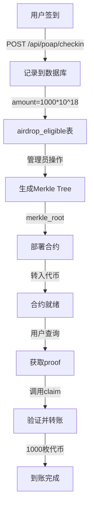

# 🎯 ERC20 代币空投系统 - 使用说明

## 快速开始

您的代币合约：`0x9Fc8A071c5a6897AD90c8614de5B26e4e75a57Aa`  
每次签到奖励：**1000 枚代币** 💰

## 📦 系统组成

```
┌─────────────────────────────────────────────────────────┐
│                    旗袍会投票空投系统                      │
└─────────────────────────────────────────────────────────┘
           │                    │                   │
           ▼                    ▼                   ▼
    ┌──────────┐        ┌──────────┐       ┌──────────┐
    │ 前端界面  │        │ 后端 API │       │ 智能合约  │
    └──────────┘        └──────────┘       └──────────┘
    │ 签到页面  │        │ 签到记录 │       │ 代币分发  │
    │ 领取页面  │        │ Merkle树 │       │ Merkle验证│
    │ 管理后台  │        │ 资格查询 │       │ 防重复    │
    └──────────┘        └──────────┘       └──────────┘
```

## 🚀 3 步部署

### 1️⃣ 生成 Merkle Tree

**Web 界面**（推荐）:
```
https://songbrocade-frontend.pages.dev/admin/merkle.html
```

**API 调用**:
```bash
curl -X POST "https://songbrocade-api.petterbrand03.workers.dev/admin/generate-merkle" \
  -H "Authorization: Bearer YOUR_TOKEN" \
  -H "Content-Type: application/json" \
  -d '{"event_id": "24"}'
```

### 2️⃣ 部署合约

```bash
cd contracts

# 配置环境变量
cat > .env << 'EOF'
PRIVATE_KEY=你的私钥
MERKLE_ROOT=步骤1获取的Merkle_Root
TOKEN_ADDRESS=0x9Fc8A071c5a6897AD90c8614de5B26e4e75a57Aa
RPC_URL=https://sepolia.base.org
PK=$PRIVATE_KEY
EOF

# 一键部署
bash ../DEPLOY_TOKEN_DISTRIBUTOR.sh

# 或手动部署
npm install
npx hardhat compile
npx hardhat run scripts/deploy-erc20-distributor.js --network baseSepolia
```

### 3️⃣ 转入代币

```javascript
// 计算所需代币
const 所需代币 = 签到人数 × 1000

// 示例：5人签到 = 5000 枚代币
```

转账到合约地址（步骤2部署的地址）

## 📱 用户使用流程

```
1. 访问签到页面
   └─> https://songbrocade-frontend.pages.dev/checkin/?event=qipao-2025

2. 连接钱包并签到
   └─> 获得：10 积分 + 空投资格 ✅

3. 等待管理员生成 Merkle Tree
   └─> 通常需要几分钟

4. 访问领取页面
   └─> https://songbrocade-frontend.pages.dev/claim/

5. 输入信息并领取
   ├─> 批次号：24（活动ID）
   ├─> 合约地址：管理员提供
   └─> 连接钱包 → 领取 → 1000 枚代币到账 🎉
```

## 📁 文件结构

```
旗袍会投票空投系统/
├── contracts/                           # 智能合约
│   ├── contracts/
│   │   └── ERC20MerkleDistributor.sol  # 代币分发合约 ✨
│   └── scripts/
│       ├── deploy-erc20-distributor.js # 部署脚本
│       ├── verify-erc20-distributor.js # 验证脚本
│       └── generate-merkle-standalone.js # Merkle工具
│
├── worker-api/                          # 后端API
│   └── index.js                        # 主路由（已更新为1000枚）
│
├── frontend/                            # 前端页面
│   ├── checkin/index.html              # 签到页面
│   ├── claim/index.html                # 领取页面（已更新）
│   └── admin/
│       └── merkle.html                 # Merkle生成页面
│
└── 文档/
    ├── ERC20_CLAIM_SETUP.md           # 详细设置指南
    ├── QUICK_DEPLOY_GUIDE.md          # 快速部署指南
    ├── ERC20_DEPLOYMENT_SUMMARY.md    # 部署总结
    └── README_ERC20.md                # 本文件
```

## 🔑 核心代码

### 签到时记录空投（worker-api/index.js）

```javascript
// 每次签到奖励 1000 枚代币
const AIRDROP_AMOUNT = "1000000000000000000000"; // 1000 * 10^18

await run(env, `
  INSERT INTO airdrop_eligible (wallet, event_id, amount, claimed, created_at)
  VALUES (?, ?, ?, 0, strftime('%s', 'now'))
`, [wallet, eventId, AIRDROP_AMOUNT]);
```

### 智能合约领取（ERC20MerkleDistributor.sol）

```solidity
function claim(
    uint256 index,
    address account, 
    uint256 amount,    // 1000 * 10^18
    bytes32[] calldata merkleProof
) external {
    require(!isClaimed(index), "Already claimed");
    require(MerkleProof.verify(merkleProof, merkleRoot, node), "Invalid proof");
    
    _setClaimed(index);
    IERC20(token).transfer(account, amount); // 转账 1000 枚
}
```

## 🧪 测试命令

```bash
# 1. 测试签到
curl -X POST "https://songbrocade-api.petterbrand03.workers.dev/api/poap/checkin" \
  -H "Content-Type: application/json" \
  -d '{"slug":"qipao-2025","code":"QIPAO-2025","address":"0x你的地址"}'

# 预期: {"ok":true,"points":10,"eligible":true}

# 2. 查询资格
curl "https://songbrocade-api.petterbrand03.workers.dev/rewards/v2/eligibility/24/0x你的地址"

# 预期(生成Merkle后): 
# {"eligible":true,"amount":"1000000000000000000000"}  ← 1000 tokens

# 3. 检查合约余额
# 在 Base Sepolia 浏览器查看
```

## 📊 数据流



## ⚙️ 环境变量

### contracts/.env
```bash
PRIVATE_KEY=你的私钥
MERKLE_ROOT=从管理后台生成的root
TOKEN_ADDRESS=0x9Fc8A071c5a6897AD90c8614de5B26e4e75a57Aa
RPC_URL=https://sepolia.base.org
BASESCAN_API_KEY=可选（用于验证合约）
```

## 🔍 故障排除

### 问题：用户无法领取

**检查清单**:
1. ✅ Merkle Tree 是否已生成？
2. ✅ 合约是否有足够代币？
3. ✅ 合约地址是否正确？
4. ✅ 用户是否已领取过？

**解决方法**:
```bash
# 查看合约余额
curl "https://sepolia.basescan.org/token/0x9Fc8A071c5a6897AD90c8614de5B26e4e75a57Aa?a=合约地址"

# 查询用户资格
curl "https://songbrocade-api.petterbrand03.workers.dev/rewards/v2/eligibility/24/用户地址"
```

### 问题：Merkle proof 验证失败

**原因**: Merkle Root 与合约不匹配

**解决**: 确保部署合约时使用的 Merkle Root 与数据库中的一致

## 💡 最佳实践

1. **测试先行**
   - 先用 2-3 个地址完整测试
   - 确认无误后再大规模部署

2. **代币准备充足**
   - 多准备 10% 的代币以防万一
   - 示例：10 人签到，准备 11000 枚

3. **保存部署信息**
   - 记录合约地址
   - 保存 Merkle Root
   - 备份 deployment-info.json

4. **监控领取情况**
   - 定期检查合约余额
   - 查看已领取人数

## 🎁 用户获得什么

- ✅ **10 积分**（每次签到）
- ✅ **1000 枚代币**（空投）
- ✅ **链上记录**（永久保存）
- ✅ **参与证明**（NFT / Token）

## 🔗 相关链接

- **前端**: https://songbrocade-frontend.pages.dev
- **管理后台**: https://songbrocade-frontend.pages.dev/admin/
- **Merkle工具**: https://songbrocade-frontend.pages.dev/admin/merkle.html
- **领取页面**: https://songbrocade-frontend.pages.dev/claim/
- **GitHub**: https://github.com/Peterpuda/qipao
- **区块链浏览器**: https://sepolia.basescan.org

## 📞 技术支持

**部署状态**: ✅ 所有代码已就绪

**当前配置**:
- 代币合约: `0x9Fc8A071c5a6897AD90c8614de5B26e4e75a57Aa`
- 每次奖励: `1000 枚`
- 网络: `Base Sepolia`

---

**🎉 开始使用：执行3步部署 → 用户即可领取1000枚代币！**

